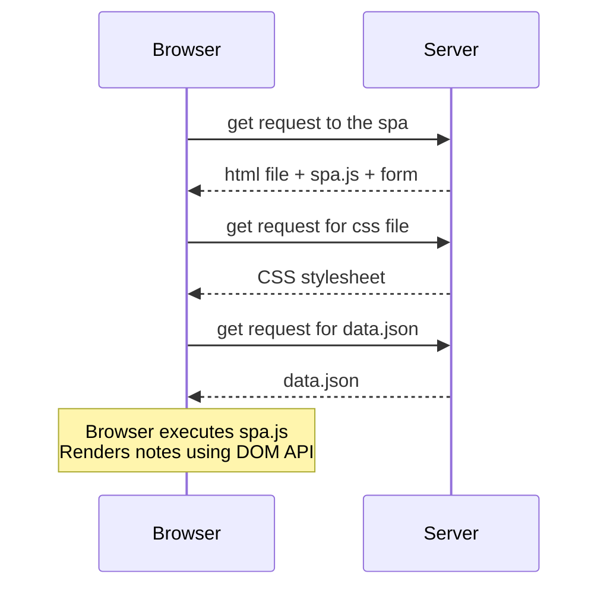

```mermaid
sequenceDiagram
    participant Browser
    participant Server

    Browser->>Server: get request to the spa
    Server-->>Browser: html file + spa.js + form

    Browser->>Server: get request for css file
    Server-->>Browser: CSS stylesheet


    Browser->>Server: get request for data.json
    Server-->>Browser: data.json

    Note over Browser: Browser executes spa.js<br/>Renders notes using DOM API
```
