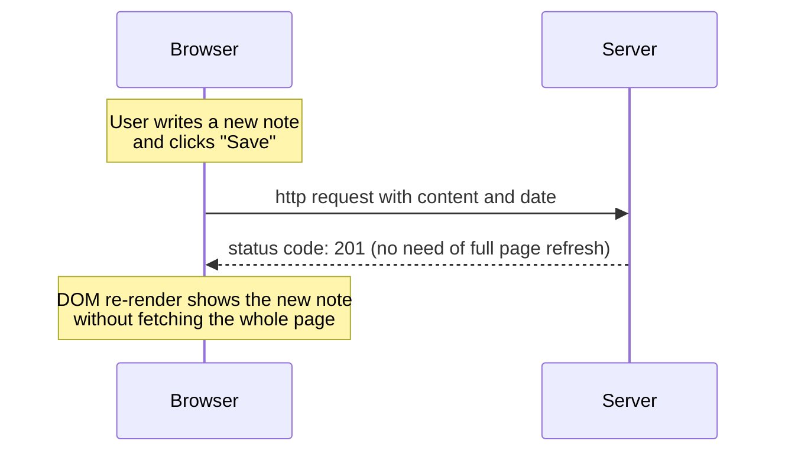

```mermaid
sequenceDiagram
    participant Browser
    participant Server

    Note over Browser: User writes a new note<br/>and clicks "Save"

    Browser->>Server: http request with content and date
    Server-->>Browser: status code: 201 (no need of full page refresh)

    Note over Browser: DOM re-render shows the new note<br/>without fetching the whole page
```
